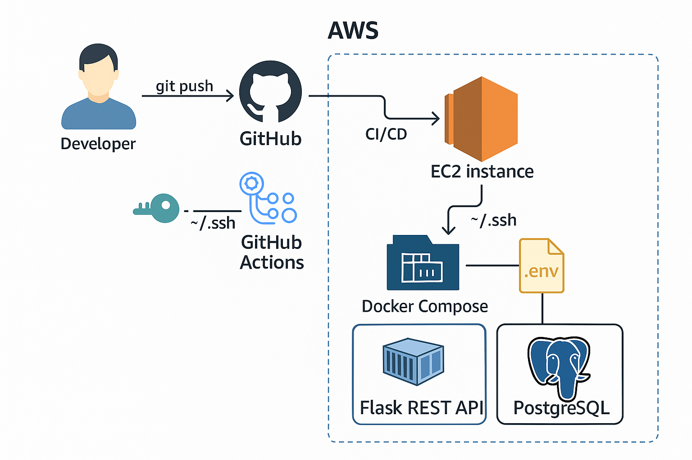
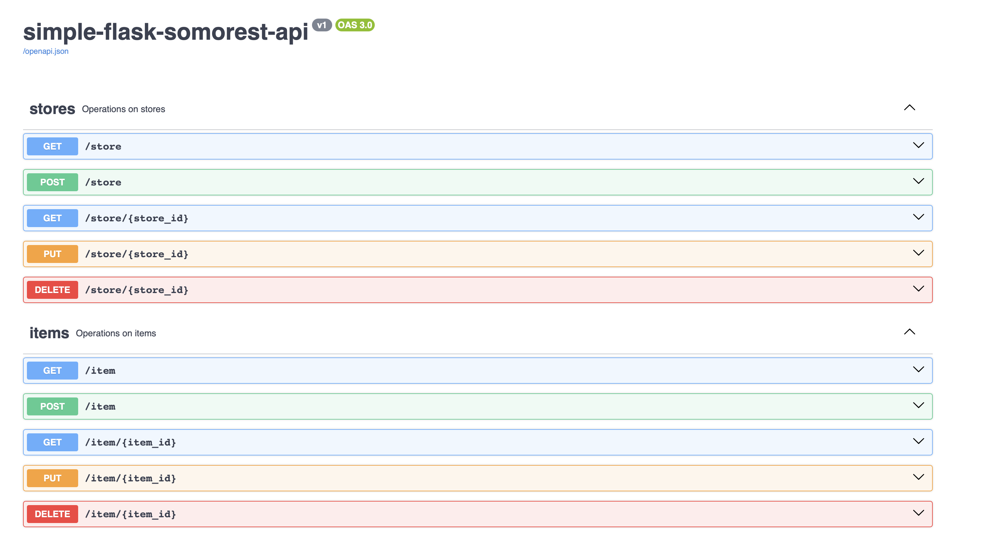
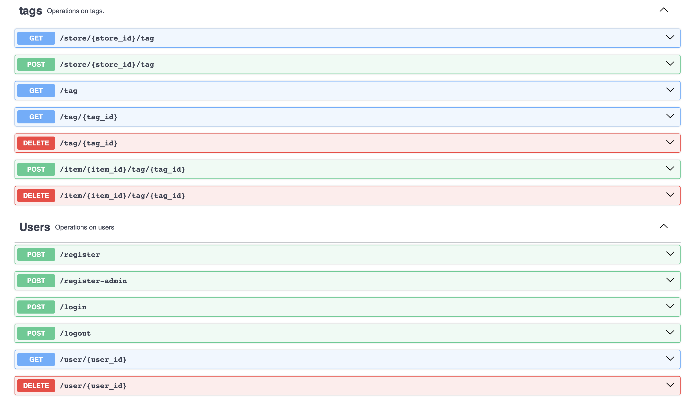

# Simple Flask Smorest REST API


This is a portfolio project I built to learn and demonstrate real-world skills in backend development, containerization, infrastructure automation, and CI/CD pipelines. It’s a production-like REST API developed with Flask, following test-driven development (TDD) using Pytest, containerized using Docker, deployed on AWS EC2 via Terraform, and integrated with a full CI/CD pipeline using GitHub Actions.

## Table of Contents
- [Features](#features)
- [Tech Stack](#tech-stack)
- [Project Structure](#project-structure)
- [How It Works](#how-it-works)
- [System Architecture](#system-architecture)
- [Application Architecture](#-application-architecture)
- [Testing](#testing)
- [Local Development](#local-development)
- [Terraform Commands](#terraform-commands)
- [API Endpoints](#api-endpoints)
- [Swagger UI](#swagger-ui)
- [Lessons Learned](#lessons-learned)
- [Next Improvements](#next-improvements)
- [License](#license)

---

## Features
- User registration and login
- JWT Authentication (with admin role support and token revocation)
- CRUD API for Items, Stores, and Tags
- Unit and integration testing with Pytest
- Docker & Docker Compose
- PostgreSQL container with persistent volumes
- Deployed on AWS EC2 using Terraform (infrastructure as code)
- Makefile with targets to automate testing, development and deployment tasks
- CI/CD pipelines via GitHub Actions for automated testing and deployment

---

## Tech Stack

| **Category**               | **Tools / Frameworks**                    |
| -------------------------- | ----------------------------------------- |
| **Backend**                | Python, Flask, Flask-Smorest, Marshmallow |
| **Authentication**         | JWT (via flask-jwt-extended)              |
| **Database**               | PostgreSQL 16.1 (Dockerized)              |
| **ORM**                    | SQLAlchemy                                |
| **Testing Frameworks**     | Pytest, Coverage.py                       |
| **Containerization**       | Docker, Docker Compose                    |
| **CI/CD**                  | GitHub Actions                            |
| **Infrastructure as Code** | Terraform                                 |
| **Hosting**                | AWS EC2 (Amazon Linux 2023)               |

---

## Project Structure

```bash
.
├── .github/
│   └── workflows/          # CI/CD workflows
│       ├── CI.yml          # testing, and build checks
│       └── CD.yml          # Deployment pipeline to AWS EC2
│
├── app/                    # Main application package
│   ├── __init__.py         # App factory
│   ├── config.py           # Environment/config settings
│   ├── db.py               # DB init and setup
│   ├── blocklist.py        # JWT token blocklist
│   ├── models/             # SQLAlchemy models
│   ├── schemas/            # Marshmallow schemas
│   └── resources/          # API endpoints (Flask-Smorest Blueprints)
│
├── test/                   # Tests (unit + integration)
│   ├── unit_test/          # Unit tests for models, schemas, etc.
│   └── integration/        # Integration tests for resources & flows
│
├── migrations/             # Alembic migration files
├── terraform-flask-api/    # Terraform configuration for AWS EC2
├── Dockerfile              # Docker build configuration
├── docker-compose.yml      # Docker Compose setup
├── Makefile                # Useful CLI commands
├── requirements.txt        # Python dependencies
├── README.md               # Project documentation
├── .env.example            # For environment varibales
└── setup.cfg               # Linting and formatting config


```

---

## How It Works

### Infrastructure (Terraform)

- EC2 instance with Amazon Linux 2023
- SSH key pair and security group (ports 22 and 5007)
- User data bootstraps the instance with Docker, Git, Make and Docker Compose

### Docker & Compose

- Flask app is built from the Dockerfile using Python 3.11
- PostgreSQL container includes volume persistence
- `docker-compose` runs both services:
    - App mapped to localhost:5007
    - Database on localhost:5432

### CI/CD Pipelines

#### CI - CI.yml
- Triggered on push/pull request to main
- Executes:
    - Installs dependencies
    - Sets PYTHONPATH
    - Runs tests via `make test`

#### CD - CD.yml

- Triggered on push/pull request to main

- Connects to EC2 via SSH
    - SSH key and host IP are securely stored in GitHub Secrets
    - Host IP is pre-approved to bypass confirmation prompt

- Deploys by:
    - Cloning or pulling the latest repo version
    - Injecting environment variables from .env via GitHub Secrets
    - Running:
        - `make up` (build and start Docker containers)
        - `make migrate` (apply DB migrations)

---
## System Architecture



This diagram illustrates how the Flask REST API is containerized with Docker and deployed on an AWS EC2 instance using Terraform. CI/CD pipelines via GitHub Actions automate testing and deployment.

---

##  Application Architecture
<!-- Mention Flask-Smorest as key to routing and response wrapping -->
The Flask app follows a modular structure that emphasizes separation of concerns and scalability:

* **App Factory Pattern**: The entry point is `create_app()` in `app/__init__.py`, allowing environment-based configuration and testing flexibility.

* **Blueprints**: Each resource (Store, Item, Tag, User) is organized as a separate blueprint in the `resources/` folder for clean routing.

* **Models**: All SQLAlchemy models are under `models/`, representing database tables and relationships.
* **Routes**: All routes follow `RESTful` design patterns and return consistent schema-validated responses.

* **Routing and API Documentation**: Powered by **Flask-Smorest**, which groups routes via Blueprints, integrates schema validation, and automatically generates interactive **OpenAPI 3.0.3** docs served at `/swagger-ui`.


* **Schemas**: Marshmallow is used for:

  * **Input validation** (e.g. checking required fields, data types)
  * **Output serialization** (returning clean, structured responses)

* **Authentication & Authorization**:

  * Uses **JWT** for secure login sessions
  * Admin-only routes are protected with role-based claims
  * JWT token revocation via a custom `BLOCKLIST`

* **Database Migrations**: Managed with Flask-Migrate (Alembic) and applied using `make migrate`.
* **Error Handling**: Custom JWT error responses for expired/invalid/missing tokens.
* **Testing**:

  * 180+ tests across unit and integration layers, providing 96% coverage
  * Test suite runs on each CI push
  * Tested locally via `make test` and **Insomnia** for manual API exploration

---

## Testing
Tests are written with pytest, organized into unit and integration levels. You can run:
```bash
make test         # Run tests
make coverage     # Run tests and view code coverage
make lint         # Lint using flake8
make format       # Auto-format with Black
```

### Coverage Report
```bash
Name                           Stmts   Miss  Cover
--------------------------------------------------
app/__init__.py                   54      1    98%
app/blocklist.py                   1      0   100%
app/config.py                     25      0   100%
app/db.py                          2      0   100%
app/models/__init__.py             5      0   100%
app/models/item_model.py          10      0   100%
app/models/item_tag_model.py       7      0   100%
app/models/store_model.py          7      0   100%
app/models/tag_model.py            9      0   100%
app/models/user_model.py           7      0   100%
app/resources/item.py             66      5    92%
app/resources/store.py            58      5    91%
app/resources/tag.py              78      7    91%
app/resources/user.py             63      0   100%
app/schemas/__init__.py            5      0   100%
app/schemas/item_schema.py        13      0   100%
app/schemas/shared_schema.py       5      0   100%
app/schemas/store_schema.py        9      0   100%
app/schemas/tag_schema.py          7      0   100%
app/schemas/user_schema.py         5      0   100%
--------------------------------------------------
TOTAL                            436     18    96%
```
---

## Local Development

1. Clone the repo:

```bash
git clone https://github.com/MosElAgab/simple-flask-smorest-rest-api.git
cd simple-flask-smorest-rest-api
```

2. Create and fill in .env:

```bash
cp .env.example .env #check .env.example for further details
```

3. Run app locally:

```bash
python -m venv .venv
source .venv/bin/activate
pip install -r requirements.txt
make run-app
```

Or with Docker:
```bash
make up
```

---

## Terraform Commands
```bash
# Plan, apply, or destroy infrastructure
make terraform-plan
make terraform-apply
make terraform-destroy
```

### Note
- Requires an IAM user with suitable permissions configured in the AWS CLI under the profile defined in provider.tf
- Key pair must be created locally at `~/.ssh/flask-api-key`, without passphrase for use in CD pipeline later. use the following shell command:
```bash
    ssh-keygen -t rsa -b 4096 -f ~/.ssh/flask-api-key -N ""
```
- EC2 instance is provisioned with Docker, Docker Compose, Git, and Make. The app is deployed using CD pipeline or manual SSH if needed.

---
## API Endpoints

| Endpoint    | Method | Auth  | Description                      |
| ----------- | ------ | ----- | ---------------------------      |
| `/register` | POST   | ❌     | Create new user                 |
| `/login`    | POST   | ❌     | Login and get access token      |
| `/store`    | CRUD   | ✅     | Manage stores                   |
| `/item`     | CRUD   | ✅     | Manage items                    |
| `/tag`      | CRUD   | ✅     | Manage tags                     |
| `/user`     | GET    | Admin  | Get user (admin only)           |
| `/user`     | DELETE | Admin  | Delete user (admin only)        |

### Home Route
The root route returns a deployment success message:
```
GET /
Hello to Simple-Flask-Smorest-REST-API, I was deployed with CD!
```

### Swagger UI
When the app is running, interactive API docs are available at:
```
locally:
http://localhost:5007/swagger-ui

or on EC2 instance:
http://<EC2_PUBLIC_IP>:5007/swagger-ui

```

#### Swagger Preview




---

## Lessons Learned
- Hands-on experience with GitHub Actions, Terraform, and Docker
- Deepened understanding of Flask app factory, blueprinting, and auth flows
- Built confidence in infrastructure automation and CI/CD setup
- Applied Makefile and shell scripting for developer productivity
- Learned to debug and automate coupled concerns like database migrations, dependency setup, and environment variable injection across dev and prod environments.

---

## Next Improvements
- Add service layer for business logic separation
- Add container health checks
- Set up Nginx reverse proxy for security
- Use Let's Encrypt for HTTPS
- Connect domain name
- Store secrets with AWS SSM or Secrets Manager
- Add monitoring (AWS Cloud-Watch)
- Support for JWT refresh tokens
- Persistent Blocklist (e.g., Redis)

---

## License
This project is open-source and free to use for learning and demonstration.

<!-- To add -->
<!-- deploying through CD pipeline: setting up secerets -->
<!-- Next imporovements: infra build and check automation via CD pipeline -->
<!-- screenshots of Swagger UI -->
<!-- screenshots of Insomia -->
